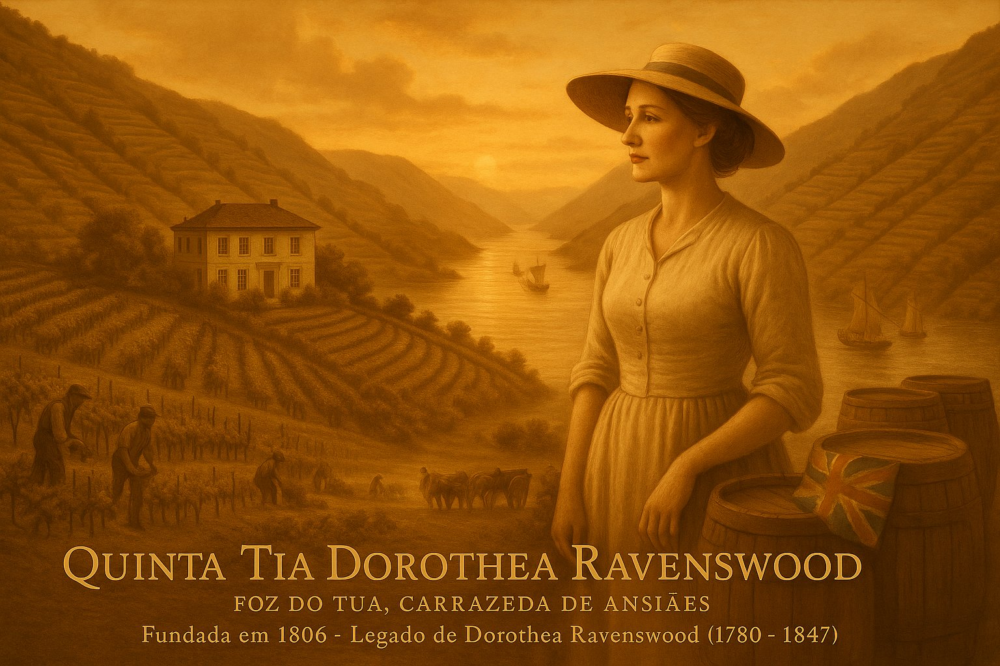
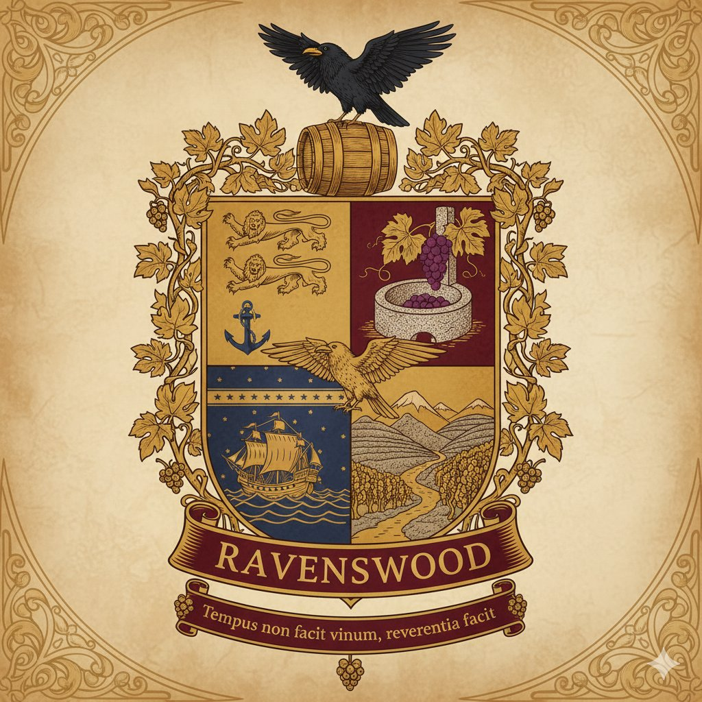

# Projeto Ravenswood - Estratégia de Marketing


*Elegância e tradição no coração do Vale do Douro - Quinta Tia Dorothea Ravenswood*

---

## Índice

1. [Sobre o Projeto](#sobre-o-projeto)
2. [Estrutura do Projeto](#estrutura-do-projeto)
3. [Documentos Principais](#documentos-principais)
   - [Estratégia de Marketing](#estratégia-de-marketing)
   - [História da Marca](#história-da-marca)
   - [Produto](#produto)
   - [Brasão Heráldico](#brasão-heráldico)
   - [Identidade Visual](#identidade-visual)
   - [Templates](#templates)
4. [Estratégia de Marketing - Visão Geral](#estratégia-de-marketing---visão-geral)
   - [Sumário Executivo](#sumário-executivo)
   - [Análise de Situação](#análise-de-situação)
   - [Definição Estratégica](#definição-estratégica)
   - [Táticas - Marketing Mix](#táticas---marketing-mix)
   - [Plano de Ação e Orçamento](#plano-de-ação-e-orçamento)
   - [Controlo e Métricas](#controlo-e-métricas)
5. [Produto: Ravenswood Tawny 40 Anos](#produto-ravenswood-tawny-40-anos)
6. [A História da Fundadora](#a-história-da-fundadora)
7. [Como Utilizar Este Projeto](#como-utilizar-este-projeto)
8. [Estado do Projeto](#estado-do-projeto)

---

## Sobre o Projeto

Este projeto contém a **estratégia de marketing completa** para o lançamento do **Ravenswood Tawny 40 Anos**, um vinho do Porto de luxo da Quinta Tia Dorothea Ravenswood, posicionado no segmento premium (PVP > 100 €).

A estratégia assenta em três pilares fundamentais:
- **Validação Crítica Internacional** (pontuações >95 pts)
- **Enoturismo de Autor** (experiências exclusivas e premium)
- **Gestão de Escassez D2C** (Direct-to-Consumer via Clube de Vinhos)

### Proposta Única de Valor (PVU)

O Ravenswood Tawny 40 Anos distingue-se pela intersecção de três elementos:
1. **Terroir Singular**: Foz do Tua (xisto e granito)
2. **Método Ravenswood**: Técnica proprietária de vinificação (pisa em granito + fortificação gradual)
3. **Herança Autêntica**: Fundada por Dorothea Ravenswood em 1806

**Tagline**: *"Não é o tempo que faz o vinho, é o respeito por ele."* — Dorothea Ravenswood (1780–1847)

---

## Estrutura do Projeto

```
ravenswood/
│
├── README.md                                          # Este ficheiro
├── ravenswood-douro-valley.jpg                        # Imagem da Quinta no Vale do Douro
├── Draft_Estrategia_Marketing_Ravenswood_v1.0.md     # Estratégia completa (versão 1.0)
├── produto_Ravenswood_Tawny_40_Anos.md               # Especificações do produto
├── resumo_história.md                                 # História da fundadora Dorothea Ravenswood
├── brasao_ravenswood.md                               # Brasão heráldico da família
├── palete_cores_ravenswood.md                         # Paleta de cores da identidade visual
├── wine_marketing_template.md                         # Template de marketing para vinhos 
├── guia_wine_marketing_template.md                    # Guia de utilização do template
└── images/                                            # Pasta com imagens
    ├── brasao-ravenswood-completo-vinhas.jpg          # Brasão completo (versão vinhas)
    ├── brasao-ravenswood-completo-terroir.jpg         # Brasão completo (versão terroir)
    ├── brasao-ravenswood-monocromatico.jpg            # Brasão em preto e branco
    ├── brasao-ravenswood-vintage.jpg                  # Brasão vintage/sépia
    ├── raven-simbolo.jpg                              # Corvo isolado
    └── garrafa-ravenswood-tawny-40-anos.jpg           # Garrafa do produto
```

---

## Documentos Principais

### Estratégia de Marketing

**Ficheiro**: [`Draft_Estrategia_Marketing_Ravenswood_v1.0.md`](Draft_Estrategia_Marketing_Ravenswood_v1.0.md)

Documento estratégico completo que inclui:
- Análise PESTAL do macroambiente
- Análise competitiva (Taylor's, Graham's, Dow's, Sandeman, Kopke, Fonseca)
- Análise SWOT
- Objetivos SMART
- Estratégia STP (Segmentação, Targeting, Posicionamento)
- Marketing Mix (4 P's: Produto, Preço, Praça, Promoção)
- Cronograma de implementação (Ano 1)
- Orçamento detalhado (150.000 €)
- KPIs e métricas de controlo
- Anexos (guia de harmonizações, compliance, matriz de risco)

### História da Marca

**Ficheiro**: [`resumo_história.md`](resumo_história.md)

Narrativa da fundadora **Dorothea Ravenswood** (1780–1847):
- Origem em Bristol, Reino Unido
- Viagem ao Douro em 1799
- Fundação da Quinta em 1806
- Legado e "Método Ravenswood"

### Produto

**Ficheiro**: [`produto_Ravenswood_Tawny_40_Anos.md`](produto_Ravenswood_Tawny_40_Anos.md)

Especificações técnicas e comerciais do Ravenswood Tawny 40 Anos:
- Ficha técnica completa
- Perfil sensorial
- Método de produção
- Posicionamento e preço
- Packaging premium

### Brasão Heráldico

**Ficheiro**: [`brasao_ravenswood.md`](brasao_ravenswood.md) | **Imagens**: [images/](images/)

O brasão da família Ravenswood é um símbolo heráldico que une as origens britânicas de Dorothea com a tradição vinícola do Douro.



**Estrutura do Brasão**:
- **Quartel 1** (Superior Esquerdo): Três leões e âncora - Origem britânica (Bristol)
- **Quartel 2** (Superior Direito): Videira sobre lagar de granito - Tradição vinícola
- **Quartel 3** (Inferior Esquerdo): Navio à vela sob estrelas - Viagem e aventura
- **Quartel 4** (Inferior Direito): Vale do Douro com socalcos - Terroir único

**Elementos Heráldicos**:
- **Timbre**: Corvo (*raven*) com asas abertas sobre barril - Sabedoria e vigilância
- **Suportes**: Folhagem de videira com uvas - Fertilidade e abundância
- **Lema**: *"Tempus non facit vinum, reverentia facit"* (Não é o tempo que faz o vinho, é o respeito por ele)

**Versões Disponíveis**:
- Brasão completo a cores (2 variantes: vinhas e terroir)
- Brasão monocromático (preto e branco)
- Brasão vintage (acabamento sépia)
- Corvo isolado (símbolo simplificado)

**Aplicações**: Rótulos premium, certificados de autenticidade, selo de cera, papelaria institucional, website.

### Identidade Visual

**Ficheiro**: [`palete_cores_ravenswood.md`](palete_cores_ravenswood.md)

Paleta de cores oficial da família Ravenswood, inspirada no brasão familiar e desenhada para garantir coerência visual em todos os materiais de marketing:

**Cores Primárias**:
- 🟡 **Dourado Envelhecido** (#C5A566) - Luxo e história
- 🔴 **Vinho Tinto Profundo** (#7C2D3B) - Paixão e vinho
- 🔵 **Azul-Escuro Atlântico** (#2F4858) - Profundidade e solidez

**Cores Secundárias**:
- 🟤 **Âmbar/Terra Envelhecida** (#D1B07A) - Calor orgânico
- ⚫ **Cinza-Granito** (#8E9B9C) - Neutralidade sofisticada
- 🟢 **Verde-Oliva Escuro** (#5D6C4F) - Natureza vinícola

**Cores Neutras**:
- ⚫ **Preto Corvo** (#1A1A1A) - Texto principal
- 🟡 **Creme/Pergaminho** (#F5ECCB) - Fundos elegantes
- ⚪ **Branco Puro** (#FFFFFF) - Alto contraste

**Aplicações**: Orientações específicas para PowerPoint, websites e documentos Word incluídas no ficheiro.

### Templates

**Ficheiros**:
- [`wine_marketing_template.md`](wine_marketing_template.md) - Template estruturado para estratégias de marketing de vinhos
- [`guia_wine_marketing_template.md`](guia_wine_marketing_template.md) - Instruções de utilização do template

---

## Estratégia de Marketing - Visão Geral

### Sumário Executivo

- **Produto**: Ravenswood Tawny 40 Anos
- **Posicionamento**: "Luxo Artesanal"
- **PVP Recomendado**: 195,00 € (Portugal) | 215,00 $ (EUA)
- **Mercados-Alvo**: Portugal (Enoturismo + On-Trade), EUA e Reino Unido (nichos fine wine)
- **Orçamento Ano 1**: 150.000 €

### Análise de Situação

#### PESTAL
- Análise do ambiente Político, Económico, Social, Tecnológico, Ambiental e Legal
- Destaque: Tendência de "premiumização seletiva" ("beber menos, mas melhor")

#### Análise Competitiva
Comparação detalhada com 6 concorrentes principais no segmento Tawny 40 Anos:
- Taylor's 40 YO (235 €, 95-96 pts)
- Graham's 40 YO (220 €, 93-96 pts)
- Dow's 40 YO (210 €, 96 pts)
- Sandeman 40 YO (160 €, 94-97 pts)
- Kopke 40 YO (180 €, 95 pts)
- Fonseca 40 YO (185 €, 91-92 pts)

#### SWOT
- **Forças**: Narrativa única, Método Ravenswood, terroir singular, validação de qualidade
- **Fraquezas**: Notoriedade limitada, distribuição reduzida, orçamento de marketing
- **Oportunidades**: Premiumização, D2C, storytelling de fundadora, apoio IVDP
- **Ameaças**: Concorrência estabelecida, alterações climáticas, custos de produção

### Definição Estratégica

#### Objetivos SMART (6 objetivos principais)
1. Pontuações ≥95 pts em 3/5 publicações (18 meses)
2. PVP médio de 190 € sem promoções
3. 20% de vendas via D2C (Ano 2)
4. 100 "Experiências Ravenswood" vendidas (Ano 1)
5. Presença em 10 restaurantes Michelin (Ano 2)
6. 50 membros fundadores do Clube (Ano 1)

#### Segmentação & Targeting
- **Primário**: Entusiasta Técnico / Colecionador (HNW, 45-65+)
- **Secundário**: Ofertante de Luxo (HNW, 35-55+)
- **Terciário**: Gatekeepers (Críticos e Sommeliers)

#### Posicionamento
*"Para o connaisseur de Vinho do Porto que procura a máxima expressão de complexidade e elegância, o **Ravenswood Tawny 40 Anos** é o único Tawny de Idade que combina a pisa em lagares de granito com o **'Método Ravenswood'** — uma fortificação gradual única, aperfeiçoada desde 1806."*

### Táticas - Marketing Mix

#### Produto
- Packaging premium (garrafa decânter, rótulo texturado, cápsula de cera numerada)
- Unboxing de luxo (caixa individual, certificado de autenticidade, história da fundadora)
- Experiência Ravenswood (90 €): visita privada com prova vertical e pairing gourmet
- Clube de Vinhos Ravenswood (alocações exclusivas)

#### Preço
- **195,00 €** (Portugal)
- **215,00 $** (EUA)
- Política de price parity (sem descontos)
- Gestão de escassez via edições numeradas

#### Praça (Distribuição)
1. **D2C** (Enoturismo + E-commerce): canal prioritário
2. **On-Trade** (Restaurantes Michelin, Hotéis 5*)
3. **Off-Trade** (Garrafeiras especializadas)
- Distribuição seletiva/exclusiva
- Importadores boutique para exportação

#### Promoção
- **RP & Críticos**: Press kits de luxo, masterclasses privadas
- **Digital**: Website imersivo, hero video, SEO, email marketing
- **Enoturismo**: Experiência como ferramenta de promoção
- **Trade**: Formação de sommeliers, sales decks técnicos

### Plano de Ação e Orçamento

#### Cronograma Ano 1 (por Trimestre)
- **T1**: Packaging, envio press kits (PT/UK), lançamento website
- **T2**: Press kits (EUA), masterclass sommeliers, lançamento enoturismo
- **T3**: Evento vindima, clube de vinhos, época alta enoturismo
- **T4**: Campanha Natal, publicações críticas, sell-through

#### Orçamento: 150.000 €
- **40%** (60.000 €): RP & Críticos
- **30%** (45.000 €): Conteúdo & Digital
- **15%** (22.500 €): Enoturismo
- **15%** (22.500 €): Materiais Trade

### Controlo e Métricas

**KPIs Principais**:
- Pontuações da crítica (Meta: >95 pts)
- PVP médio (Meta: 190 €)
- Nº Experiências Ravenswood vendidas (Meta: 100)
- Taxa de conversão Visitante → Clube (Meta: 10%)
- Presença em imprensa Tier 1 (EMV)
- Tráfego orgânico (SEO)

**Revisão**: Reuniões trimestrais com ajustes táticos

---

## Produto: Ravenswood Tawny 40 Anos

### Características Principais
- **Categoria**: Vinho do Porto - Tawny com Indicação de Idade
- **Idade Média**: 40 anos em casco de carvalho
- **Terroir**: Foz do Tua (xisto + granito)
- **Método**: Pisa em lagar de granito + fortificação gradual (Método Ravenswood)
- **Volume**: 750ml
- **Teor Alcoólico**: ~20% vol.

### Perfil Sensorial
- **Visual**: Cor âmbar luminosa com reflexos acobreados
- **Aromático**: Frutos secos (noz, amêndoa), casca de laranja cristalizada, balsâmicos, especiarias
- **Palato**: Denso, acidez vibrante, final longo e elegante

### Harmonizações
- Queijos azuis (Stilton, Roquefort)
- Queijo da Serra da Estrela curado
- Foie gras
- Doçaria conventual
- Digestivo contemplativo

### Temperatura de Serviço
14-16°C (ligeiramente fresco)

---

## A História da Fundadora

**Dorothea Ravenswood** (1780–1847) nasceu em Bristol, Reino Unido, numa família de mercadores de vinho. Em 1799, aos 19 anos, viajou até ao Douro e apaixonou-se pela região e pela arte da vinificação do Porto.

Em **1806**, fundou a **Quinta Tia Dorothea Ravenswood** na Foz do Tua, tornando-se uma das raras mulheres produtoras de Vinho do Porto no século XIX.

### O Método Ravenswood

Dorothea desenvolveu uma técnica proprietária que combina:
1. **Pisa a pé em lagares de granito** (tradição)
2. **Fortificação gradual em três tempos** (inovação técnica)

Esta abordagem confere aos vinhos uma elegância e longevidade únicas.

### Filosofia

*"Não é o tempo que faz o vinho, é o respeito por ele."*

Esta frase resume a visão de Dorothea: o envelhecimento é essencial, mas é a intervenção cuidadosa e respeitosa do produtor que define a qualidade.

---

## Como Utilizar Este Projeto

### Para Profissionais de Marketing
1. Consultar a [Estratégia Completa](Draft_Estrategia_Marketing_Ravenswood_v1.0.md) para compreender o posicionamento e as táticas
2. Utilizar o [Template de Marketing](wine_marketing_template.md) para criar estratégias similares
3. Adaptar as táticas D2C e de enoturismo ao contexto específico

### Para Produtores de Vinho
1. Estudar a análise competitiva (secção 2.2) para benchmark de preços e posicionamento
2. Consultar o guia de harmonizações (Anexo 4) para formação de equipas
3. Adaptar o modelo de enoturismo premium

### Para Estudantes e Investigadores
1. Analisar a estrutura completa de uma estratégia de marketing de luxo
2. Estudar a aplicação prática dos frameworks (PESTAL, SWOT, STP, 4 P's)
3. Compreender a dinâmica competitiva do mercado de Vinho do Porto premium

---

## Estado do Projeto

**Versão Atual**: 1.0 (Draft)

**Documentos Completos**:
- ✅ Estratégia de Marketing (Draft v1.0)
- ✅ História da Fundadora
- ✅ Especificações do Produto
- ✅ Brasão Heráldico da Família (5 versões otimizadas)
- ✅ Paleta de Cores e Identidade Visual
- ✅ Templates de Marketing

**Próximos Passos**:
- [ ] Validação com stakeholders
- [ ] Refinamento do orçamento
- [ ] Desenvolvimento do website
- [ ] Produção do press kit
- [ ] Definição do calendário de envio de amostras

---

## Contactos e Recursos

### Referências Regulamentares
- [IVDP - Instituto dos Vinhos do Douro e do Porto](https://www.ivdp.pt/)
- Regulamento IVDP para Tawnies com Indicação de Idade
- Regulamento UE 2021/2117 (Rotulagem)

### Recursos de Marketing
- Análise competitiva completa (Tabela 2.2.1)
- Mapa de mensagem (Anexo 2)
- Guia de harmonizações (Anexo 4)
- Matriz de risco-mitigação (Anexo 3)
- Brasão heráldico da família (brasao_ravenswood.md)
- Paleta de cores oficial da marca (palete_cores_ravenswood.md)

---

**Nota**: Este projeto é um documento estratégico de referência. Todos os dados, preços e pontuações da concorrência são baseados em pesquisa de mercado atualizada (fontes citadas na bibliografia do documento principal).

---

*Projeto desenvolvido para a Quinta Tia Dorothea Ravenswood*
*"Não é o tempo que faz o vinho, é o respeito por ele."*
