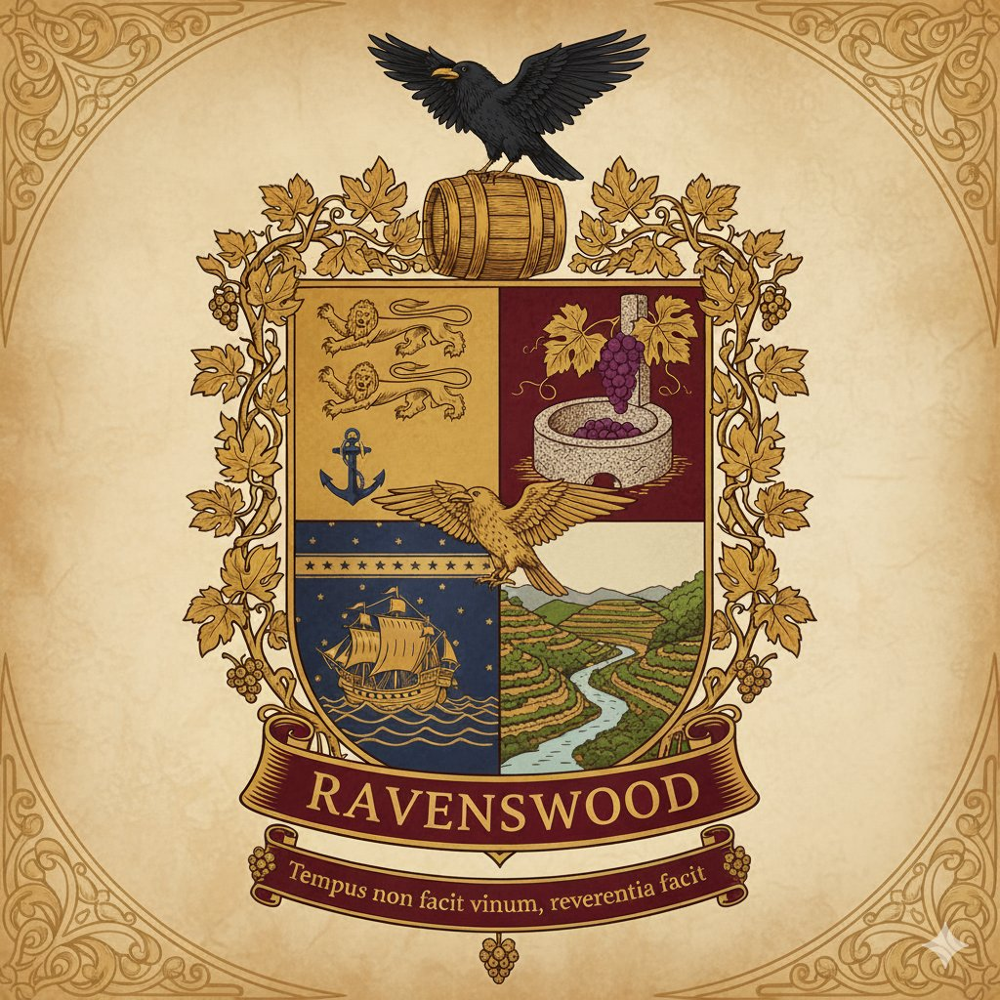
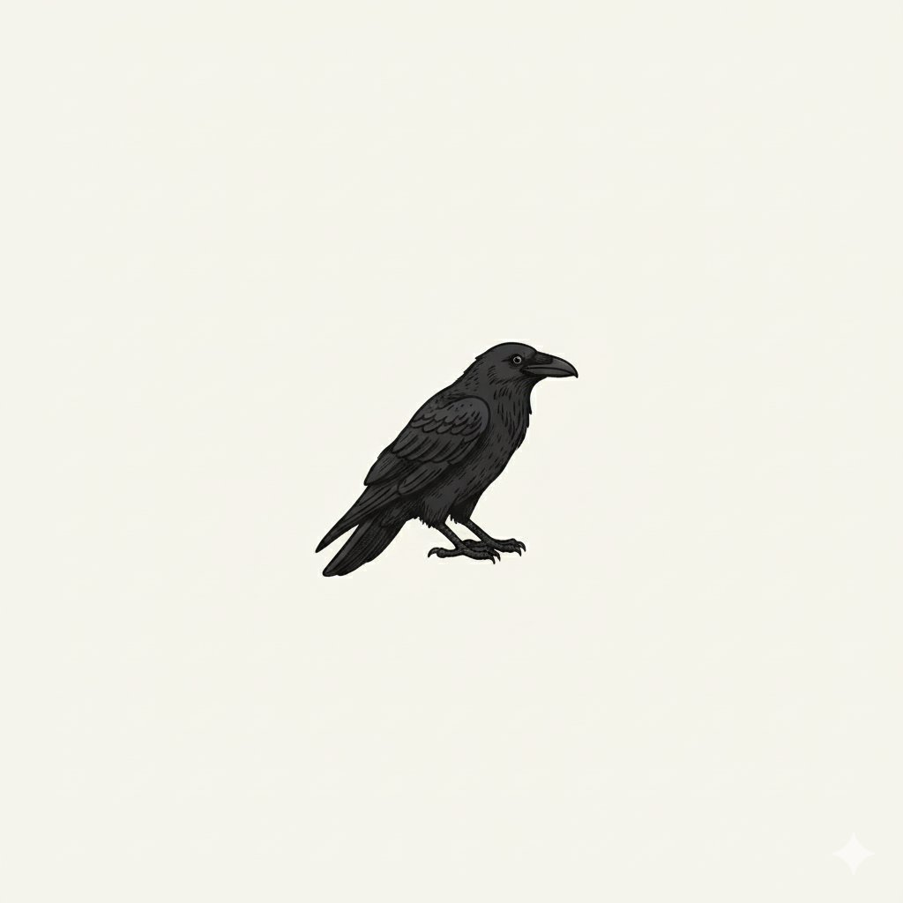
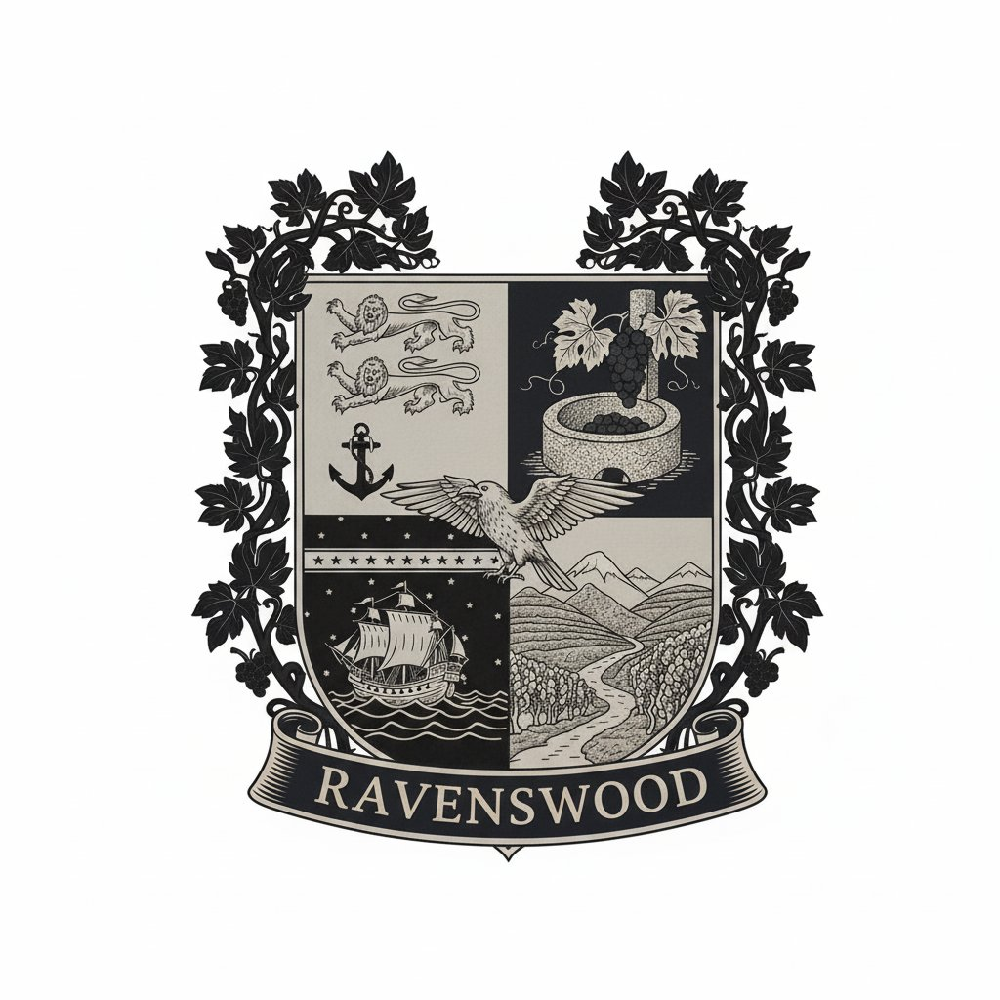
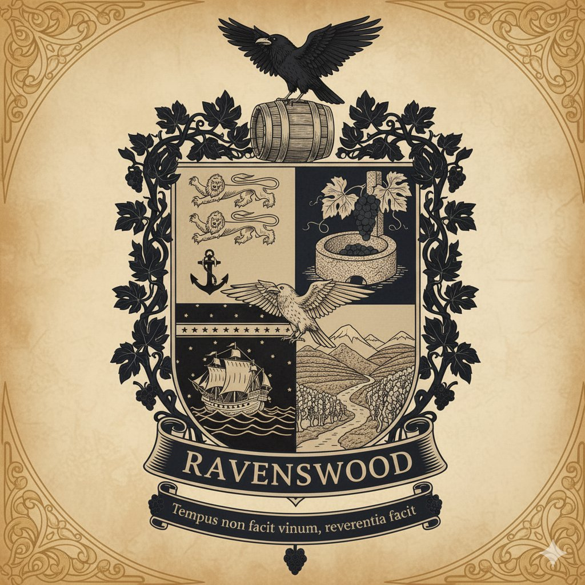

# Brasão da Família Ravenswood

## Descrição Heráldica

Este brasão de armas, concebido em estilo heráldico clássico britânico com apontamentos vitorianos e portugueses, evoca a nobre herança da família Ravenswood, fundindo as suas raízes atlânticas em Bristol com a profunda ligação ao Vale do Douro e à arte vinícola. A paleta de cores — dourado envelhecido, vinho tinto profundo, âmbar, azul-escuro atlântico e cinza-granito — confere-lhe uma atmosfera refinada, histórica e simbólica.

---

## Versões do Brasão

### Brasão Completo - Versão Vinhas

*Versão principal do brasão com destaque para os elementos vinícolas e a paisagem verde do Douro*

### Brasão Completo - Versão Terroir

*Versão alternativa destacando o terroir único de xisto e granito da Foz do Tua*

---

## Elementos Heráldicos

### Timbre

No cimo do brasão, pousado majestosamente sobre um barril de carvalho, encontra-se um **corvo negro de asas abertas**. O corvo, símbolo principal e epónimo da família "Ravenswood" (Bosque dos Corvos), representa sabedoria, mistério e uma conexão profunda com a natureza e o tempo. O barril simboliza a produção e o envelhecimento do vinho, a essência da sua herança vinícola.

*O corvo isolado - timbre e símbolo heráldico central da família Ravenswood*

### Escudo

O escudo está dividido em quatro quadrantes, equilibrando elementos heráldicos ingleses e portugueses:

* **Primeiro Quadrante (Canto Superior Esquerdo):** De fundo dourado envelhecido, apresenta **três leões passantes guardantes em pala**, evocando a heráldica real inglesa e a origem de Bristol. Abaixo dos leões, uma **âncora de ferro**, símbolo das rotas marítimas, do comércio e da fundação em Bristol, reforçando a ligação atlântica.

* **Segundo Quadrante (Canto Superior Direito):** De fundo em vinho tinto profundo, este quadrante exibe um **lagar de granito**, onde cachos de uva de tons púrpura são esmagados. Este elemento representa vividamente a produção tradicional do vinho do Porto e a importância da vinicultura para a família, bem como a sua ligação às paisagens do Douro.

* **Terceiro Quadrante (Canto Inferior Esquerdo):** Com um fundo em azul-escuro atlântico, salpicado de estrelas douradas, este quadrante ilustra um **navio mercante em plena navegação** sobre ondas agitadas. Este elemento simboliza as viagens transatlânticas, o comércio entre Inglaterra e Portugal, e as rotas que transportavam o vinho do Porto para o mundo. As estrelas podem aludir à navegação noturna e à ambição da família.

* **Quarto Quadrante (Canto Inferior Direito):** De fundo em tons de âmbar e cinza-granito, este quadrante retrata **montes em socalcos e um rio que serpenteia entre eles**, com vinhas a cobrir as encostas. Esta imagem é uma clara homenagem à paisagem icónica do Vale do Douro, berço da produção de vinho da família, e à sua profunda ligação com a terra e o terroir português. Um **falcão com as asas estendidas** sobrevoa esta paisagem, simbolizando a visão, a liberdade e a perspicácia.

### Ornamentação Exterior

O escudo é artisticamente envolvido por **ramos de videira dourada com folhas e pequenos cachos de uva**, que se entrelaçam elegantemente, sublinhando a temática vinícola e a prosperidade da família ligada ao vinho.

### Faixa e Divisa

A base do brasão é adornada por uma **faixa em vinho tinto profundo, com o nome "RAVENSWOOD" em letras serifadas douradas**, conferindo-lhe um caráter formal e de pertença familiar.

Abaixo desta, uma faixa mais pequena contém a divisa (mote) da família em latim: **"Tempus non facit vinum, reverentia facit."** (O tempo não faz o vinho, a reverência faz.), que reflete a filosofia da família sobre a importância da dedicação, do respeito pela tradição e pelo processo na criação de um vinho de excelência.

---

## Versões Alternativas

### Brasão Monocromático

*Versão em preto e branco para aplicações em impressão monocromática, gravação ou selos*

### Brasão Vintage

*Versão sépia com acabamento envelhecido, ideal para documentos históricos e certificados de edição limitada*

---

## Aplicações do Brasão

### Usos Principais

* **Rótulos Premium**: Versão completa a cores nos rótulos do Tawny 40 Anos e edições especiais
* **Certificados de Autenticidade**: Brasão em relevo ou hot stamping dourado
* **Selo de Cera**: Corvo isolado ou escudo simplificado para garrafas numeradas
* **Papelaria Institucional**: Cabeçalhos de correspondência oficial
* **Website e Digital**: Versões adaptadas conforme o fundo (monocromático ou vintage)
* **Merchandising**: Corvo isolado como símbolo simplificado

### Cores Heráldicas

As cores utilizadas no brasão estão alinhadas com a [paleta de cores oficial da marca](palete_cores_ravenswood.md):

* **Dourado/Ouro** (#C5A566): Riqueza, nobreza, excelência
* **Vinho Tinto/Gules** (#7C2D3B): Paixão, coragem, tradição vinícola
* **Azul-Marinho/Azure** (#2F4858): Lealdade, verdade, profundidade marítima
* **Verde-Oliva** (#5D6C4F): Natureza, esperança, fertilidade da vinha
* **Preto/Sable** (#1A1A1A): Sabedoria, resiliência (corvo)
* **Pergaminho/Creme** (#F5ECCB): Tradição, autenticidade

---

## Significado e Legado

Este brasão é uma representação visual da rica tapeçaria de culturas, comércio e paixão que define a história da família Ravenswood. Cada elemento conta parte da jornada de **Dorothea Ravenswood** (1780–1847) desde Bristol até ao Vale do Douro, unindo duas pátrias, duas tradições e duas culturas numa única herança vinícola de excelência.

O brasão não é apenas um símbolo decorativo — é a **alma da casa**, gravada em ouro e pedra, que perdura através das gerações.
