# Guia de Elaboração do Plano de Marketing — Quinta de Vinho do Porto

Este documento descreve a estrutura lógica e o fluxo de trabalho para a preparação de um **Plano Estratégico de Marketing** de uma quinta produtora de Vinho do Porto, focado em posicionamento *premium/luxo*, diferenciação de marca e expansão internacional.

---

## Estrutura do Plano

O plano segue seis **etapas encadeadas**, representadas no diagrama em grupos de cor distintos, que asseguram um percurso lógico desde a análise até ao controlo final dos resultados:

1. **Kickoff e Alinhamento** — Definição de objetivos, equipa, briefing da marca, plano de trabalho e aprovação inicial da direção.  
2. **Análise de Situação — Onde Estamos** *(azul)*  
   - Avaliação **PESTAL** (contexto político, económico, sociocultural, tecnológico, ambiental e legal).  
   - Análise do **mercado**, **concorrência**, **consumidor** e **recursos internos** (terroir, enologia, património, portfólio e enoturismo).  
   - Consolidação de dados e validação da **SWOT** como síntese do diagnóstico.  
3. **Definição Estratégica — Para Onde Vamos** *(verde)*  
   - Definição de **objetivos SMART**.  
   - **Segmentação** geográfica e comportamental.  
   - Escolha de **públicos-alvo** primários e secundários.  
   - **Posicionamento** e formulação da proposta única de valor.  
   - Teste de coerência entre SWOT, recursos e objetivos.  
4. **Táticas — Marketing Mix** *(amarelo)*  
   - **Produto:** portfólio, marca, storytelling, packaging e experiência de enoturismo.  
   - **Preço:** estratégia de valor percebido e coerência com o posicionamento premium.  
   - **Praça:** canais de distribuição (D2C, on-trade, off-trade, exportação).  
   - **Promoção:** relações públicas, críticos, marketing digital, eventos e formação.  
   - Revisão de viabilidade e mensurabilidade das táticas.  
5. **Plano de Ação e Orçamento** *(roxo)*  
   - Cronograma alinhado ao ciclo da vinha e ao calendário comercial.  
   - Definição de responsáveis (modelo RACI) e parcerias.  
   - Orçamento detalhado por pilar, plano de riscos e conformidade legal.  
   - Aprovação final pela direção.  
6. **Implementação e Controlo — KPIs** *(rosa)*  
   - Execução operacional: produção de conteúdos, campanhas e eventos.  
   - Monitorização de **dashboards** financeiros e de marketing.  
   - Avaliação de métricas de **enoturismo**, **vendas D2C** e **comunicação**.  
   - Revisão trimestral e ajustes táticos conforme os resultados.  
   - Escalar o que funciona, consolidar aprendizagens e preparar o ciclo seguinte.

---

## Explicação do Diagrama

O diagrama Mermaid correspondente apresenta um **fluxo vertical e contínuo**, onde cada etapa conduz naturalmente à seguinte.  
As **cores** indicam grupos funcionais (análise, estratégia, tática, operação e controlo), e os **diamantes** representam pontos de decisão e validação.

O processo segue o princípio de **melhoria contínua**:

- As fases iniciais constroem uma base sólida de dados e insights.  
- A definição estratégica alinha os objetivos com os recursos reais.  
- As táticas traduzem a estratégia em ações mensuráveis.  
- A execução aplica o plano no terreno com controlo orçamental e prazos definidos.  
- O controlo final fecha o ciclo, avaliando resultados e permitindo recomeçar com maior precisão.

Este modelo assegura **coerência, rastreabilidade e foco nos resultados**, promovendo uma gestão de marketing estruturada, sustentável e alinhada com a identidade e ambição da marca.

```mermaid
  flowchart TD
    %% Diagrama otimizado sem subgraphs com grupos por cor

    %% Arranque
    A[Kickoff e alinhamento] --> A1[Definir objetivos do projeto e equipa]
    A1 --> A2[Recolher brief da marca e restricoes]
    A2 --> A3[Plano de trabalho cronograma e entregaveis]
    A3 --> G1{Aprovacao de direcao}
    G1 -- Nao --> A2
    G1 -- Sim --> B1

    %% Analise encadeada
    B1[Analise PESTAL politico economico sociocultural tecnologico ambiental legal] --> B2[Analise do mercado por categoria por pais por canal]
    B2 --> B3[Analise da concorrencia casas de Porto e quintas comparaveis]
    B3 --> B4[Analise do consumidor perfil motivacoes jornada]
    B4 --> B5[Analise interna terroir enologia historia portfolio enoturismo recursos]
    B5 --> B6[Consolidar dados e evidencias]
    B6 --> C{Dados suficientes e confiaveis}
    C -- Nao --> B6
    C -- Sim --> D[Analise SWOT sintese]

    %% Estrategia encadeada
    D --> D1[Definir objetivos de marketing modelo SMART]
    D1 --> D3[Segmentacao geografica comportamental canal]
    D3 --> D4[Escolha de targets primario secundario gatekeepers]
    D4 --> D5[Posicionamento e proposta unica de valor]
    D5 --> D6[Hipoteses estrategicas e criterios de escolha]
    D6 --> E{Objetivos coerentes com SWOT e recursos}
    E -- Nao --> D1
    E -- Sim --> F1

    %% Taticas encadeadas
    F1[Estrategia de produto gama marca storytelling packaging experiencia na quinta clube servicos] --> F2[Estrategia de preco valor percebido posicao premium grelhas por canal alocacao de raridades]
    F2 --> F3[Estrategia de praca distribuicao seletiva D2C on trade off trade exportacao]
    F3 --> F4[Estrategia de promocao relacoes publicas criticos conteudo digital enoturismo materiais formacao]
    F4 --> F5[Mapa de canais e prioridades]
    F5 --> H{Taticas viaveis e mensuraveis}
    H -- Nao --> F5
    H -- Sim --> I1

    %% Operacao encadeada
    I1[Cronograma alinhado ao ciclo da vinha e ao ciclo comercial] --> I2[Responsaveis funcoes e RACI]
    I2 --> I3[Recursos e parcerias chave]
    I3 --> I4[Orcamento por pilar enoturismo relacoes publicas digital materiais]
    I4 --> I5[Plano de riscos e mitigacao]
    I5 --> I6[Checklist de conformidade IVDP rotulagem publicidade a alcool]
    I6 --> J{Aprovacao final de direcao}
    J -- Nao --> I4
    J -- Sim --> K1

    %% Implementacao encadeada
    K1[Lancar tarefas e contratos] --> K2[Produzir conteudos e materiais]
    K2 --> K3[Ativar campanhas D2C on trade off trade]
    K3 --> K4[Organizar provas e eventos de imprensa]
    K4 --> K5[Formacao de equipas e distribuidores]
    K5 --> L1

    %% Controlo encadeado
    L1[Dashboards de marca e financeiro faturacao preco medio margem] --> L2[Metricas de enoturismo e D2C visitantes conversao clube vendas online]
    L2 --> L3[Metricas de comunicacao e relacoes publicas pontuacoes critica imprensa engagement]
    L3 --> L4[Reunioes trimestrais para ajuste de taticas]
    L4 --> L5[Aprendizagens e iteracao continua]
    L5 --> M{KPIs dentro das metas}
    M -- Nao --> N[Reforcar ou reconfigurar taticas e orcamento]
    N --> L4
    M -- Sim --> O[Escalar iniciativas vencedoras e consolidar posicao]
    O --> P[Resumo executivo atualizado para conselho]
    P --> Q[Fim do ciclo e preparacao do ciclo seguinte]

    %% Classes para cores
    classDef ana fill:#e8f1ff,stroke:#6b9dfc,stroke-width:1px,color:#0b2a5b
    classDef strat fill:#e8fff1,stroke:#4fbf87,stroke-width:1px,color:#0b3b25
    classDef tact fill:#fff6e5,stroke:#ffb347,stroke-width:1px,color:#5a3a00
    classDef ops fill:#f3e8ff,stroke:#a073ff,stroke-width:1px,color:#2e0b5b
    classDef ctrl fill:#ffe8ee,stroke:#ff6b95,stroke-width:1px,color:#5b0b28
    classDef gate fill:#222,stroke:#bbb,stroke-width:1px,color:#fff

    %% Aplicacao das classes
    class B1,B2,B3,B4,B5,B6,D ana
    class D1,D3,D4,D5,D6 strat
    class F1,F2,F3,F4,F5 tact
    class I1,I2,I3,I4,I5,I6 ops
    class L1,L2,L3,L4,L5 ctrl
    class C,E,H,J,M gate

```

