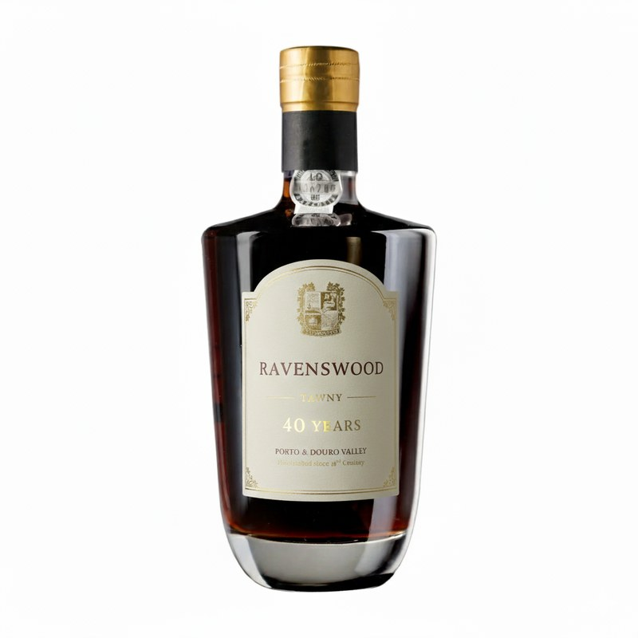

# **Ravenswood Tawny 40 Anos — O Tempo Refinado pelo Respeito**

Há vinhos que se medem em anos. E há vinhos que se medem em gerações.
O **Ravenswood Tawny 40 Anos** é o culminar de mais de dois séculos de respeito, paciência e elegância — um vinho nascido da visão de **Dorothea Ravenswood**, a fundadora que, em 1806, desafiou o seu tempo ao unir a precisão inglesa à alma do Douro.

Criado na **Quinta Tia Dorothea Ravenswood**, no coração das encostas graníticas e xistosas da **Foz do Tua**, este Tawny é a expressão suprema do **Método Ravenswood**: pisa a pé em lagares de granito e **fortificação gradual em três tempos**, um processo que Dorothea idealizou para permitir uma integração perfeita entre o vinho jovem e a aguardente vínica de qualidade superior.
O resultado é um equilíbrio raro entre **doçura e acidez vibrante**, entre **profundidade e leveza**, entre o **tempo e o gesto humano**.

Composto por um **blend de vinhos muito velhos**, envelhecidos em casco ao longo de décadas, o Ravenswood 40 Anos é um retrato líquido da história da Quinta. Cada pipa foi selecionada entre os **lotes históricos** que a família preservou desde o século XIX, guardados em madeira portuguesa e francesa nas caves de Vila Nova de Gaia, onde o ar atlântico refina lentamente cada molécula.

A cor **âmbar dourada**, de brilho hipnótico, anuncia uma complexidade que só o tempo e o respeito permitem alcançar. No nariz, revela camadas de **noz, amêndoa tostada, casca de laranja cristalizada e canela**, envolvidas por notas balsâmicas de madeira antiga.
Na boca, é **denso e sedoso**, com uma acidez viva que sustenta a doçura e prolonga o prazer. O final é **profundo, interminável**, ecoando o Douro e o Atlântico numa harmonia rara.

Mais do que um vinho, o Ravenswood Tawny 40 Anos é uma **declaração de filosofia**:
“Não é o tempo que faz o vinho, é o respeito por ele.”
Cada gota é um tributo à visão de Dorothea, à persistência de quem acreditou que o verdadeiro luxo está na serenidade do trabalho bem feito — e não na pressa da recompensa.

Hoje, sob a mesma luz que outrora iluminou os lagares de granito, o legado de Dorothea mantém-se vivo. O Ravenswood Tawny 40 Anos é o emblema dessa continuidade: um vinho de contemplação e herança, feito para ser apreciado lentamente, como uma história que se ouve em silêncio e se recorda para sempre.

---

## Características — Ravenswood Tawny 40 Anos

*Garrafa premium do Ravenswood Tawny 40 Anos — Elegância e tradição em cada detalhe*

### Castas  

Blend clássico das **castas nobres do Douro**, selecionadas de **vinhas muito velhas**:  
**Touriga Nacional, Touriga Franca, Tinta Roriz, Tinto Cão e Sousão.**  

Composição resultante da seleção de **vinhos do Porto de idade avançada**, provenientes de **lotes históricos da Quinta Tia Dorothea Ravenswood**, envelhecidos em casco ao longo de várias décadas.  

---

### Tipo de Solo  
**Granítico e xistoso**, típico das **encostas íngremes do Alto Douro**, proporcionando vinhos de **estrutura firme**, **acidez equilibrada** e **extraordinária capacidade de guarda**.  

---

### Vinificação  
Produzido segundo os **métodos tradicionais da Região Demarcada do Douro**, a mais antiga do mundo (1756).  
Pisado a pé em **lagares de granito** e **fortificado com aguardente vínica de qualidade superior**, de forma faseada, seguindo o antigo **“Método Ravenswood”** — uma técnica desenvolvida na própria quinta que conjuga **elegância e longevidade**.  

---

### Prémios Recentes *(Fictícios)*  
🏅 **Grande Medalha de Ouro “Douro & Porto Masters 2023”** — Câmara de Provas do Douro  
🥇 **Melhor Tawny 40 Anos – Porto Excellence Awards 2022**  
🏆 **Prémio “Escolha da Imprensa” 2021 – Revista Enológica Contemporânea**  
⭐ **18,5/20 “Altamente Recomendado 2022” – Revista Vinhos & Paixões**  
🥈 **“Heritage Wine Trophy 2024” – International Port Challenge, Londres**

## Ficheiro Técnico — Ravenswood Tawny 40 Anos

**Categoria**: Vinho do Porto • **Estilo**: Tawny 40 Anos (DOC Porto) • **NV** (lote multicolheitas)  
**Produto**: Ravenswood Tawny 40 Anos • **Quinta**: Tia Dorothea Ravenswood • **Origem**: Alto Douro (Foz do Tua), Portugal  

---

### 1) Identidade & Enquadramento
- **Castas (vinhas muito velhas)**: Touriga Nacional, Touriga Franca, Tinta Roriz, Tinto Cão, Sousão.  
- **Terroir**: Encostas íngremes de **xisto e granito**; altitude mista; forte amplitude térmica; exposição solar sul/poente.  
- **Filosofia**: Luxo artesanal; seleção de **lotes históricos** com idade média de 40 anos em casco; assinatura enológica própria (**Método Ravenswood**).

> *“Não é o tempo que faz o vinho, é o respeito por ele.”* — Dorothea Ravenswood

---

### 2) Viticultura
- **Origem das uvas**: Vinhas muito velhas em mistura de campo (field blend) no Alto Douro.  
- **Práticas**: Viticultura manual em socalcos; condução tradicional; colheita seletiva em caixas pequenas; sustentabilidade hídrica e manutenção de muros de xisto.  
- **Solos**: Xistosos (estrutura e calor) e graníticos (frescura e acidez).

---

### 3) Enologia (Método Ravenswood)
- **Pisa**: Pisa a pé em **lagares de granito** com extração controlada.  
- **Fortificação**: **Aguardente vínica de qualidade superior**, adicionada **de forma faseada (três tempos)** para integração progressiva.  
- **Parâmetros de fermentação**: Gestão de temperatura para preservar acidez e perfume antes da fortificação.  
- **Estágio**: Oxidativo, prolongado, em **cascos de carvalho português e francês** (600 L e tonéis), parte na Quinta e parte em **Vila Nova de Gaia**.  
- **Lote**: *Blend* de vinhos muito velhos com **perfil organoléptico médio de 40 anos** (conforme prova pela Câmara de Provadores do IVDP).

---

### 4) Análise (valores indicativos — variam por lote e data de engarrafamento)
- **Álcool**: 20,0 % vol  
- **Açúcares residuais**: 120–150 g/L  
- **Acidez total**: 5,0–6,5 g/L (ácido tartárico)  
- **pH**: 3,4–3,6  
- **Acidez volátil**: 0,50–0,70 g/L (ácido acético)  
- **SO₂ total**: ≤ 115 mg/L • **SO₂ livre**: 25–35 mg/L  
- **Cor**: Âmbar dourado profundo

> *Nota*: valores laboratoriais do lote de engarrafamento disponíveis mediante solicitação (CoA).

---

### 5) Prova (perfil sensorial)
- **Nariz**: Frutos secos (noz, avelã, amêndoa), **casca de laranja cristalizada**, canela, toffee, notas balsâmicas e de madeira antiga.  
- **Boca**: Entrada sedosa e densa; **acidez vibrante** equilibra a doçura; enorme amplitude e finesse.  
- **Final**: Muito longo, âmbar, com ecos salinos do Douro e do Atlântico.

---

### 6) Serviço & Harmonizações
- **Temperatura de serviço**: **14–16 ºC**. Não servir quente.  
- **Copo**: Copo de vinho branco (tipo Riesling) ou Porto Premium (taça alta).  
- **Decantação**: Não necessária (estágio oxidativo).  
- **Conservação após abertura**: **4–8 semanas** (rolhada, refrigerada).  
- **Harmonizações**:  
  - **Clássicas**: **Stilton**, Roquefort, **Queijo da Serra da Estrela curado**; frutos secos; doçaria conventual, crème brûlée, tarte tatin.  
  - **Contemporâneas**: *Foie gras* (frio/escalfado), pratos agridoces, sobremesas cítricas.

---

### 7) Packaging & Logística
- **Formato**: 750 mL (disponível em 1500 mL por alocação).  
- **Garrafa**: Vidro escuro premium (ombros altos / decanter-style).  
- **Fecho**: Rolha de cortiça natural; cápsula em cera (edições numeradas).  
- **Caixa**: Individual de luxo (madeira ou cartão rígido *book-style*).  
- **Unidades por caixa**: 3 / 6 garrafas.  
- **Peso líquido**: 1,35 kg (750 mL) • **Peso bruto c/ caixa**: ~8,5 kg (6x750 mL).  
- **Pallet**: 80x120 cm (EU) • 75–100 caixas/palete (configuração sob consulta).  
- **Códigos**:  
  - **EAN-13 (750 mL)**: _placeholder_  
  - **ITF-14 (Cx 6)**: _placeholder_  
  - **Cód. pautal (HS Code)**: 220421

---

### 8) Compliance
- **IVDP — Selo de Garantia**: Categoria **Tawny 40 Anos**, *blend* aprovado pela Câmara de Provadores (perfil sensorial de idade média 40 anos).  
- **Rotulagem UE (Reg. 2021/2117)**: Ingredientes e informação nutricional disponibilizados via **e‑label (QR Code)** no contra‑rótulo.  
- **Alergénios**: **Contém sulfitos**.  
- **Consumo responsável**: ≥ 18 anos; moderação recomendada.

---

### 9) Lote & Disponibilidade
- **Lote de engarrafamento**: _ex.: L40A-2025_  
- **Data de engarrafamento**: _MM/AAAA_  
- **Volume do lote**: _ex.: 2.400 garrafas (750 mL) + 120 magnums_  
- **Mercados prioritários**: PT (D2C, Enoturismo, On-Trade de topo), UK, EUA.  
- **Condições de transporte/armazenamento**: 12–16 ºC; HR 60–70%; ao abrigo de luz e vibração.

---

### 10) Contacto
**Quinta Tia Dorothea Ravenswood** — Foz do Tua, Alto Douro, Portugal  
**Email**: trade@ravenswood.pt • **Telefone**: +351 000 000 000  
**Website**: www.ravenswood.pt

---

#### Annex A — English Trade Sheet (One‑Pager)

**Product**: Ravenswood Tawny 40 Years — DOC Porto (NV, multi‑vintage blend)  
**Origin**: Alto Douro (Foz do Tua) — schist & granite slopes; old vines (field blend).  
**Varieties**: Touriga Nacional, Touriga Franca, Tinta Roriz (Tempranillo), Tinto Cão, Sousão.  
**Winemaking (Ravenswood Method)**: Foot‑treading in granite *lagares*; gradual fortification (three additions) with high‑grade grape spirit; oxidative aging in seasoned Portuguese & French oak (Quinta & Vila Nova de Gaia).  
**Average Age**: 40 years in cask (sensory approval by IVDP tasting panel).  

**Analysis (indicative)**: Alc 20.0% vol; RS 120–150 g/L; TA 5.0–6.5 g/L (tartaric); pH 3.4–3.6; VA 0.50–0.70 g/L; Total SO₂ ≤115 mg/L.  
**Tasting**: Amber‑gold; walnut, roasted almond, orange peel, cinnamon, balsamic wood; dense yet vibrant; very long finish.  
**Serve**: 14–16 ºC; white‑wine stem; no decanting; 4–8 weeks after opening (refrigerated).  
**Food Pairing**: Stilton, Serra da Estrela (aged), foie gras, crème brûlée, conventual pastries, toasted nuts.  
**Pack**: 750 mL (1.5 L on allocation); natural cork; wax capsule (numbered); luxury single box; case of 3/6.  
**Compliance**: IVDP guarantee seal; EU e‑label (QR); Contains sulfites.  
**HS Code**: 220421 • **Shelf/Storage**: 12–16 ºC, protected from light/vibration.
